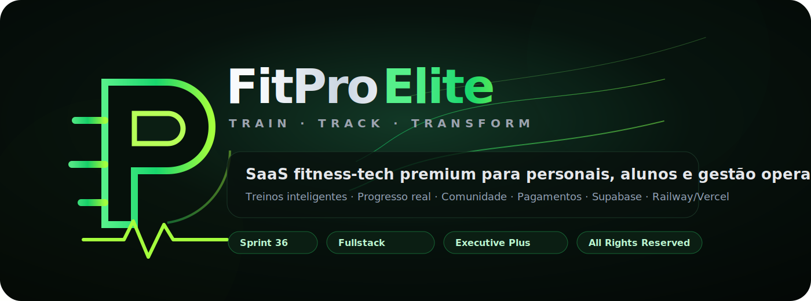
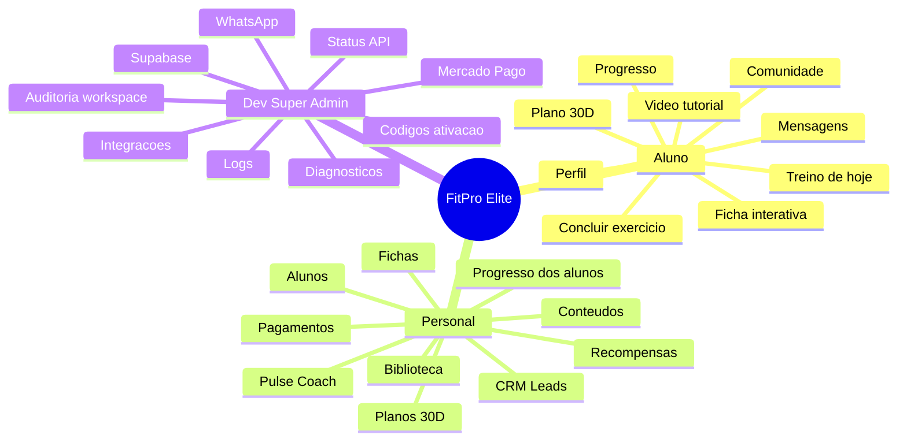
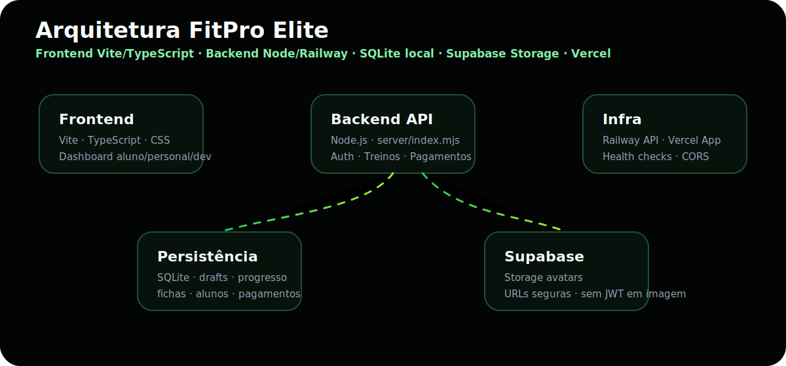

<!--
  FitPro Elite README
  Autor: Mateus Paiva / uPaiva
  Uso: portfólio e demonstração técnica. Não é licença open source.
-->

<p align="center">
  
</p>

<p align="center">
  
  
  
  
</p>

<h1 align="center">FitPro Elite</h1>

<p align="center">
  <strong>Fitness-tech executive SaaS</strong> para personal trainers, alunos e administração técnica.
  <br />
  Treinos inteligentes · Progresso real · Comunidade · Pagamentos · Supabase · WhatsApp · Dev/Super Admin
</p>

---

## 01 · Visão executiva

**FitPro Elite** é uma plataforma fitness-tech premium criada para centralizar a operação de personal trainers e a experiência digital dos alunos em um único ambiente: cadastro, planos, fichas, treinos, comunidade, pagamentos, mensagens, progresso, avatar, auditoria e acompanhamento operacional.

A direção do produto segue o princípio:

> **Completo por trás, simples por fora.**

Ou seja: o sistema pode ter permissões, rascunhos, histórico, versões, progresso, integrações, auditoria, pagamentos, Supabase, Mercado Pago, WhatsApp e painéis técnicos, mas cada perfil deve enxergar somente o que faz sentido para o seu uso diário.

---

## 02 · Identidade do produto

| Pilar | Direção |
|---|---|
| **Visual** | Dark premium, emerald/neon, fitness-tech, executivo, limpo e responsivo |
| **Produto** | SaaS completo para gestão fitness, alunos, fichas, progresso e pagamentos |
| **Experiência** | Aluno simples, personal produtivo, Dev/Admin completo |
| **Marca** | FitPro Elite · `TRAIN · TRACK · TRANSFORM` |
| **Regra de UX** | Completo por trás, simples por fora |
| **Regra de entrega** | Não quebrar login, sessão, deploy, dados, rotas, permissões ou fluxos existentes |

---

## 03 · Mapa rápido do sistema



---

## 04 · Snapshot técnico do repositório

<p align="center">
  
</p>

| Métrica | Valor |
|---:|---|
| Arquivos analisados no ZIP mais recente | **82** |
| Linhas aproximadas | **14.825** |
| Documentos `.md` de histórico/sprints | **45** |
| Arquivos backend `.mjs` | **11** |
| Arquivos TypeScript | **4** |
| SQL/Supabase | **6** |
| Build target | **Vite + TypeScript** |
| API target | **Node.js / Railway** |

> Estes números foram levantados a partir do ZIP mais recente da linha Sprint 36.

---

## 05 · Stack e infraestrutura

<p align="center">
  
</p>

| Camada | Tecnologias / Função |
|---|---|
| **Frontend** | Vite, TypeScript, CSS, PWA, SVG, UI dark premium |
| **Backend** | Node.js, módulos `.mjs`, API em `server/index.mjs` |
| **Banco local** | SQLite em `data/fitpro.sqlite` |
| **Storage** | Supabase Storage para avatars |
| **Deploy API** | Railway |
| **Deploy App** | Vercel |
| **Pagamentos** | Mercado Pago, comprovantes manuais, planos e códigos |
| **Comunicação** | WhatsApp contextual, mensagens internas |
| **Legal** | Termos, Privacidade, LGPD, Cookies e aviso fitness |
| **DevOps local** | Script Windows `.cmd` para instalar, testar, buildar e subir GitHub |

---

## 06 · Estrutura do projeto

```txt
FitPro ELITE/
├─ src/
│  ├─ main.ts
│  ├─ api.ts
│  ├─ styles.css
│  └─ vite-env.d.ts
├─ server/
│  ├─ index.mjs
│  ├─ db.mjs
│  ├─ supabase.mjs
│  ├─ integrations.mjs
│  ├─ security.mjs
│  ├─ config.mjs
│  ├─ seed.mjs
│  ├─ sync.mjs
│  └─ database-adapter.mjs
├─ public/
│  ├─ favicon.svg
│  ├─ app-icon.svg
│  ├─ manifest.webmanifest
│  └─ sw.js
├─ docs/
│  ├─ RELATORIO_SPRINT_*.md
│  ├─ SUPABASE_*.sql
│  └─ readme-assets/
├─ data/
│  └─ .gitkeep
├─ scripts/
│  ├─ dev.mjs
│  └─ smoke-production.mjs
├─ railway.json
├─ vercel.json
├─ vite.config.ts
├─ tsconfig.json
├─ package.json
├─ package-lock.json
├─ .gitignore
└─ fitpro-safe-update-push-v3.cmd
```

---

## 07 · Perfis e permissões

| Perfil | Enxerga | Não deve enxergar |
|---|---|---|
| **Aluno** | Treino de hoje, próximo treino, meus treinos, progresso, personal, mensagens, comunidade, recompensas e perfil | Logs, integrações, auditoria, automações, edição técnica de fichas |
| **Personal** | Visão geral, coach, solicitações, alunos, treinos, pagamentos, plano, conteúdos, comunidade, mensagens, relatórios, CRM, sorteios, recompensas, perfil e ações rápidas | Logs, integrações técnicas, automações técnicas e auditoria profunda |
| **Dev/Super Admin** | Logs, integrações, automações, auditoria, status API, health checks, Mercado Pago, WhatsApp, Supabase, uploads, comprovantes e diagnósticos | — |

Mensagem padrão para rota técnica sem permissão:

```txt
Acesso restrito. Este módulo é exclusivo do painel Dev/Super Admin.
```

---

## 08 · Módulos principais

### Área do aluno

| Módulo | Função |
|---|---|
| **Treino de hoje** | Mostra o treino calculado pela data real |
| **Plano 30D** | Exibe Dia X de 30, semana atual, próximo treino e progresso |
| **Ficha interativa** | Exercícios com vídeo/tutorial, conclusão e progresso |
| **Player YouTube** | Player embutido quando há link; busca segura quando não há vídeo |
| **Concluir exercício** | Marca exercício como feito com persistência real |
| **Concluir treino do dia** | Fecha o dia, registra conclusão e dispara animação premium |
| **Comunidade** | Feed, posts, comentários, reactions e desafios |
| **Mensagens** | Comunicação aluno/personal |
| **Perfil** | Avatar, dados pessoais, cidade/UF, preferências e vínculo com personal |

### Área do personal

| Módulo | Função |
|---|---|
| **Pulse Coach** | Visão operacional do dia |
| **Alunos** | Lista, status, progresso e ações |
| **Treinos/Fichas** | Criação manual, templates semanais, planos 30D, editor, autosave |
| **Biblioteca** | Exercícios, grupos, vídeos, substituição inteligente |
| **Planos 30D** | Aplicação individual ou em massa para alunos |
| **Monitoramento** | Execução dos alunos, progresso, atrasos e treinos concluídos |
| **Pagamentos** | Plano FitPro, comprovantes, histórico e status |
| **CRM/Leads** | Funil inicial de interessados |
| **Mensagens/WhatsApp** | Contato contextual com alunos |
| **Modelos próprios** | Favoritos e templates personalizados do personal |

### Dev / Super Admin

| Módulo | Função |
|---|---|
| **Status da API** | `/health` e `/api/health` |
| **Auditoria workspace** | API, banco, auth, uploads, pagamentos e integrações |
| **Códigos de ativação** | Criar, listar, cancelar, reativar e auditar |
| **Integrações** | Mercado Pago, WhatsApp, Supabase, Resend, OpenAI |
| **Pagamentos** | Comprovantes, planos, status e diagnósticos |
| **Logs e rotas críticas** | Monitoramento técnico sem expor secrets |

---

## 09 · Fluxo de treinos


---

## 10 · Funcionalidades de treino já contempladas

| Área | Recursos |
|---|---|
| **Templates semanais** | Iniciante, Hipertrofia ABC/ABCD, Full Body, Emagrecimento, Casa, Força, Mobilidade, Cardio/Core |
| **Planos 30D** | Hipertrofia Base, Emagrecimento + Condicionamento, Força Essencial, Iniciante Total, Casa Sem Equipamento, Mobilidade/Postura/Core, Glúteos e Pernas |
| **Wizard de ficha** | Dados gerais, estrutura semanal, exercícios, progressão, revisão/publicação |
| **Biblioteca avançada** | Grupos musculares, filtros, adicionar ao treino ativo, substituição inteligente |
| **Edição de exercício** | Séries, reps, descanso, carga, técnica, observações, mover, duplicar, remover |
| **Rascunhos** | Autosave local e backend em evolução |
| **Histórico** | Versionamento de fichas e eventos principais |
| **Visão do aluno** | Hoje, próximo treino, semana completa, plano completo e progresso |
| **Conclusão** | Exercícios concluídos, progresso diário, treino finalizado e animação |

---

## 11 · Avatar e Supabase

O fluxo de avatar foi direcionado para **Supabase Storage** usando o bucket `avatars`.

### Regras do avatar

- Nunca usar `access_token` em URL de imagem.
- Nunca renderizar `user_id` puro como ``.
- Salvar no banco uma URL/path válido.
- Sincronizar `users`, `trainers`, `students`, comunidade e comentários.
- Retornar avatar normalizado no bootstrap/sessão.
- Manter fallback com iniciais somente quando não houver imagem válida.

---

## 12 · Pagamentos e planos

| Item | Status |
|---|---|
| **FitPro Start** | R$ 49,99/mês |
| **FitPro Plus** | R$ 149,99/mês |
| **Código de ativação** | Alternativa ao pagamento direto |
| **Mercado Pago** | Checkout/backend configurável |
| **Comprovante manual** | Upload, análise, histórico e aprovação/reprovação |
| **Gate do personal** | Personal sem plano/código ativo não acessa painel completo |

---

## 13 · Segurança e privacidade

### Nunca versionar

```txt
.env
tokens
secrets
service role key
JWT
banco real com dados sensíveis
uploads privados
node_modules
dist
backups privados
```

### Variáveis esperadas em ambiente privado

```env
AUTH_SECRET=coloque-seu-auth-secret-aqui
VITE_API_URL=https://sua-api.up.railway.app
API_URL=https://sua-api.up.railway.app

WHATSAPP_PHONE=
WHATSAPP_BUSINESS_TOKEN=
WHATSAPP_BUSINESS_PHONE_ID=
WHATSAPP_VERIFY_TOKEN=

MERCADO_PAGO_ACCESS_TOKEN=
MERCADO_PAGO_PUBLIC_KEY=
MERCADO_PAGO_WEBHOOK_SECRET=

SUPABASE_URL=
SUPABASE_SERVICE_ROLE_KEY=
SUPABASE_AVATAR_BUCKET=avatars
```

> A `SUPABASE_SERVICE_ROLE_KEY` deve existir somente no backend/Railway. Nunca usar `VITE_` para segredo privado.

---

## 14 · Legal, saúde e LGPD

FitPro Elite possui estrutura para:

| Link | Função |
|---|---|
| **Termos** | Regras de uso, responsabilidades, pagamentos, limitação de responsabilidade |
| **Privacidade** | Dados coletados, finalidades, bases legais, compartilhamento e retenção |
| **LGPD** | Central de direitos do titular |
| **Cookies** | Preferências, necessários, funcionais, analíticos e terceiros |
| **Suporte** | Canal de atendimento e orientação |

Aviso essencial:

> FitPro Elite é uma plataforma tecnológica de apoio e organização fitness. Não substitui médico, nutricionista, fisioterapeuta, educador físico ou outro profissional habilitado.

---

## 15 · Scripts disponíveis

```json
{
  "dev": "node scripts/dev.mjs",
  "client": "vite --host 0.0.0.0",
  "server": "node server/index.mjs",
  "build": "tsc --noEmit && vite build",
  "type-check": "tsc --noEmit",
  "start": "node server/index.mjs",
  "reset:db": "node server/seed.mjs --reset",
  "dev:api": "node --watch server/index.mjs",
  "dev:client": "vite --host 0.0.0.0",
  "seed": "node server/seed.mjs",
  "smoke:production": "node scripts/smoke-production.mjs"
}
```

---

## 16 · Rodando localmente

```bash
cd "C:\Users\mpaii\Documents\Projetos\FitPro ELITE"

copy "C:\Users\mpaii\Documents\Projetos\_keys_privadas\fitpro.env.backup" "C:\Users\mpaii\Documents\Projetos\FitPro ELITE\.env"

npm install --registry https://registry.npmjs.org/

npm run type-check
npm run build
npm run server
npm run dev
```

---

## 17 · Script Windows de conveniência

O projeto inclui:

```txt
fitpro-safe-update-push-v3.cmd
```

Ele automatiza:

- restaurar `.env` privado;
- instalar dependências;
- rodar type-check;
- rodar build;
- configurar Git;
- criar commit;
- buscar remoto;
- confirmar antes de `--force-with-lease`.

O script é incluído nos ZIPs para facilitar uso local, mas deve ficar ignorado pelo Git.

```gitignore
fitpro-safe-update-push*.cmd
fitpro-atualizar-testar-subir-github*.bat
```

---

## 18 · Deploy

### Backend / Railway

Checklist:

- `server/index.mjs` usando `process.env.PORT`;
- `HOST=0.0.0.0`;
- `/health` e `/api/health` antes das rotas protegidas;
- CORS e `OPTIONS` antes de auth;
- comando de start: `npm run server`;
- secrets somente no Railway.

### Frontend / Vercel

Checklist:

- `VITE_API_URL` apontando para Railway;
- não colocar secrets no frontend;
- não usar service role;
- build com Vite;
- favicon/app icon/manifest funcionando.

---

## 19 · GitHub

```bash
git init
git branch -M main

git remote remove origin
git remote add origin https://github.com/EoPaiva/FitPro.git

git status --ignored

git add .
git commit -m "docs: add FitPro Elite executive README"

git pull origin main --rebase
git push -u origin main
```

Se houver histórico divergente e a pasta local for realmente a correta:

```bash
git fetch origin
git push -u origin main --force-with-lease
```

> Use `--force-with-lease` somente quando tiver certeza da pasta correta e entender o risco.

---

## 20 · Roadmap por prioridade

### 🟢 Implementado / encaminhado

- Login, logout e sessão.
- Health checks.
- Painéis por perfil.
- Fichas e planos de treino.
- Planos 30D.
- Ficha interativa do aluno.
- Player YouTube/busca segura.
- Progresso e conclusão de treino.
- Avatar com Supabase Storage.
- Footer compacto.
- Legal/LGPD/Cookies.
- Códigos de ativação.
- Mercado Pago backend configurável.
- Super Admin status/auditoria.
- Script Windows local.

### 🟡 Parcial / em evolução

- Dashboard analítico profundo por aluno/dia/exercício/carga.
- Autosave backend total antes do primeiro salvamento.
- Aplicação em massa com personalização individual.
- Modelos próprios do personal com fluxo completo de reutilização.
- Indicador avançado de volume semanal por grupo muscular.
- Player YouTube com tratamento completo para Shorts/playlists/links inválidos.
- Relatórios financeiros e operacionais avançados.
- CRM/Leads e mensagens internas com fluxo mais completo.

### 🔴 Em espera

- Supabase-first 100% do banco.
- Marketplace/split Mercado Pago.
- Comissão automática da plataforma.
- KYC/conta conectada do personal.
- Multi-tenant completo.
- Push notifications avançado.
- Antifraude avançado.
- PDF de avaliação física.
- Google Calendar/Meet avançado.

---

## 21 · Atualizações

### 🟢 Adições recentes

- Fichas inteligentes com templates semanais.
- Planos 30D completos.
- Ficha do aluno interativa.
- Conclusão de exercício com persistência.
- Player YouTube e busca de vídeo.
- Progresso do aluno.
- Monitoramento do personal.
- Autosave backend e modelos do personal.
- Aplicação de plano para vários alunos.
- Substituição inteligente.

### 🟡 Ajustes e melhorias

- Logo premium em evolução.
- Dashboards menos densos.
- Footer compacto.
- Permissões por role.
- Avatar com Supabase Storage.
- Legal/LGPD/Cookies.
- Scripts de conveniência.

### 🔴 Remoções/Restrições intencionais

- Sem secrets no repositório.
- Sem `.env` real.
- Sem banco real com dados sensíveis.
- Sem uploads privados.
- Sem `node_modules`.
- Sem `dist`.
- Sem módulos técnicos para aluno/personal quando são exclusivos do Dev/Super Admin.

---

## 22 · Qualidade visual

Direção visual mantida:

- dark mode premium;
- emerald/neon controlado;
- cards respirados;
- hierarquia clara;
- brilho discreto;
- animações leves;
- mobile responsivo;
- linguagem simples para aluno/personal;
- técnico apenas onde precisa ser técnico.

---

## 23 · Licença e uso

Este repositório é disponibilizado publicamente para fins de **portfólio, demonstração técnica e registro de evolução do projeto**.

**Não é um projeto open source.**

É proibido, sem autorização prévia e expressa do autor:

- copiar;
- revender;
- redistribuir;
- clonar comercialmente;
- remover créditos;
- usar a identidade visual;
- reutilizar fluxos, telas, textos, estrutura ou código para produto concorrente.

© 2026 **Mateus Paiva / uPaiva**. Todos os direitos reservados.

---

<p align="center">
  <strong>FitPro Elite</strong><br/>
  Fitness-tech executive SaaS · TRAIN · TRACK · TRANSFORM
</p>
